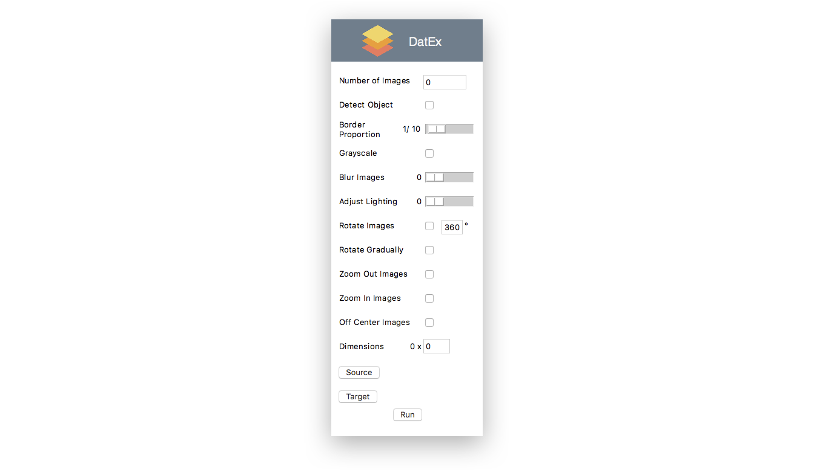

# DatEx

## Introduction

DatEx is meant to support the provision of a training dataset for the SPARCS deep learning project. This is achieved by expanding training datasets with synthetically generated training data. The goal of the SPARCS deep learning project is the automatic recognition of small pieces in overhauling processes.

Aircraft undergo heavy maintenance checks approximately every six years, which includes an overhauling process of the aircraft's engines. During this overhauling process, the engine has to be disassembled to check all parts for signs of wear and reassembled afterward. In order to keep track of all small pieces that are removed during disassembly, such as screws, bolts, nuts, pins, and washers, they are sorted. SPARCS' small-pieces recognition system is designed to automize this sorting process.

## Prerequisites

In order to function properly, DatEx requires the NumPy and OpenCV libraries. A step-by-step instruction on how to install them can be found [here](http://www.pyimagesearch.com/2015/06/29/install-opencv-3-0-and-python-3-4-on-osx/).

## Operation

After DatEx started, a window appears which lets you choose the preferences for the execution of the tool.

The following list gives an overview of the different settings that can be made.

- **Number of Images** - Determines the number of synthetic images generated from each image of a given base training dataset.
- **Detect Object** - Decides whether or not DatEx attempts to detect the object inside the image
- **Border Proportion** - This value defines the proportion of the border to the rest of the image. Parts of the image that are not containing an object are considered the image's borders.
- **Grayscale** - All generated images will be grayscaled with this option enabled
- **Blur Images** - Defines a possible range of values by which generated images will be blurred. The concrete value is calculated randomly
- **Adjust Lighting** - DatEx randomly adjusts the lighting of each generated image. How strong this adjustment can be, is determined by this value.
- **Rotate Images** - Enabling this option will rotate all generated images by a random angle with an upper boundary defined in the field next to it
- **Rotate Gradually** - If for example DatEx generates 360 images from each image of a base training dataset, rotating the generated images gradually means rotating each image by 1 degree more than the previous one.
- **Zoom Out Images** - If you enable this option, DatEx will randomly zoom out of every generated by a random factor
- **Zoom In Images** - By enabling this option, DatEx zooms into every generated image by a random factor
- **Off Center Images** - Shift the object in every generated image to a random direction by a random amount
- **Dimensions** - Set the dimensions of all generated images (Dimensions are always square)
- **Source** - Choose source folder containing the images of the base training dataset (Images have to be named after the following scheme: `label.number.format`)
- **Target** - Choose folder in which the images of the expanded training dataset should be saved